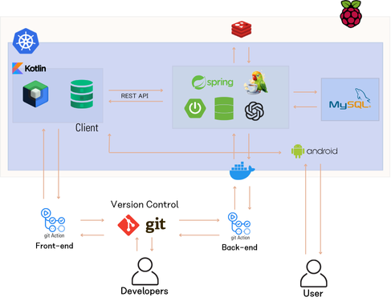
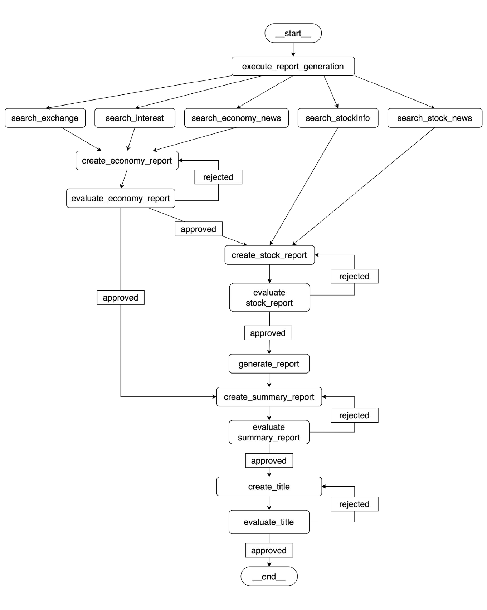

<h1>BigPicture</h1>

## 개요
AI 기반 거시경제 요약 리포트 서비스

## 시스템 아키텍처

## 담당한 기능
* [자동화 데이터 크롤링 구현](1-자동화-데이터-크롤링-구현)
* [리포트 생성 파이프라인 설계 및 구현](2-리포트-생성-파이프라인-설계-및-구현)
* [CI/CD 및 무중단 배포 인프라 구성](3-CI/CD-및-무중단-배포-인프라-구성)

## 1. 자동화 데이터 크롤링 구현
### 개요
* 여러 경제 데이터들을 주기적으로 크롤링
* 달러 환율, 한국 금리, 미국 금리, 경제 뉴스, 주식 뉴스, 주가 데이터
* 데이터 업데이트 시점 및 외부 트래픽을 고려하여 스케줄링 시간 고려

### 문제 및 의사결정 과정
#### 1. 뉴스 데이터 크롤링 및 저장 방식
* 하루 기준 20개 내외의 뉴스 크롤링 및 저장해야 함(경제 뉴스 기준)
* 모든 뉴스 원문을 저장할 경우 LLM 모델 사용 비용 증가, 데이터 품질 저하, 저장 공간 낭비 문제가 발생
* LLM 기반 MapReduce 방식을 활용

**LLM MapReduce 방식**

* 전체 뉴스 데이터를 한번에 LLM에 전달하지 않고, 작은 청크(뉴스 단위)로 분할하여(Map 단계) 각각 요약을 생성
* 생성된 개별 요약을 다시 합쳐서(Reduce 단계) 최종 요약을 생성

### 성과
* LLM 토큰 제한 문제를 해결하고 비용과 품질을 최적화 가능

## 2. 리포트 생성 파이프라인 설계 및 구현
### 개요
* 수집된 데이터들을 바탕으로 요약 리포트 생성

### 문제 및 의사결정 과정
#### 1. 리포트 생성 방식
* 모든 데이터들을 한번에 LLM에 전달할 경우 생성 데이터 품질 저하, 일관되지 않은 응답 데이터 생성 문제 발생

* LLM Refine 방식을 사용하여 단계별 생성 방식 적용
* 경제 리포트 생성 &rarr; 주식 리포트 생성 &rarr; 요약 리포트 생성 &rarr; 제목 생성
* LLM as a Judge 방식으로 생성된 결과물을 평가하고 임계치 이상의 점수가 나올 때까지 재생성(최대 3번)

**LLM Refine 방식**

* 청크별 초기 요약을 생성한 후, 다음 청크와 이전 요약을 함께 LLM에 전달해 점진적으로 요약을 개선해 나가는 방식
* 입력 문서를 순회하며 반복적으로 기존 요약을 업데이트하며 응답을 구성하는 단계별 생성 방식으로, 요약 품질과 일관성이 더욱 높아짐

#### 2. 리포트 재사용 캐시 적용
* 리포트 생성에 약 1-2분 소요 및 10,000~20,000 토큰이 입력으로 사용
* 캐시를 적용하여 생성된 리포트를 재사용
* 사용자가 적은 새벽 시간대에 리포트를 미리 생성

* 위와 같이 리포트 생성 중 또 다른 리포트 생성 요청을 막기 위해 Single Flight 패턴과 DCL 적용
* 레디스 SET NX를 사용한 분산락을 기반으로 구현

**Single Flight 패턴**
* 동일한 키에 대해 중복되는 작업을 한 번만 실행하도록 보장하는 디자인 패턴
* 고가의 연산이 필요하거나, 요청이 중첩되는 상황에서 중복 실행을 방지하여 성능을 개선

**DCL**
* Double Checked Locking
* 락을 획득한 후 캐시를 한번 더 확인하여 중복 처리를 방지하는 방식

### 성과

* 리포트 생성 API 응답 시간이 p95 기준 29,872ms  190ms로 약 157배 개선됨
* 리포트 품질 향상 및 반복적인 리포트 생성 비용 절약

## 3. CI/CD 및 무중단 배포 인프라 구성
### 개요
### 문제 및 의사결정 과정
### 성과
