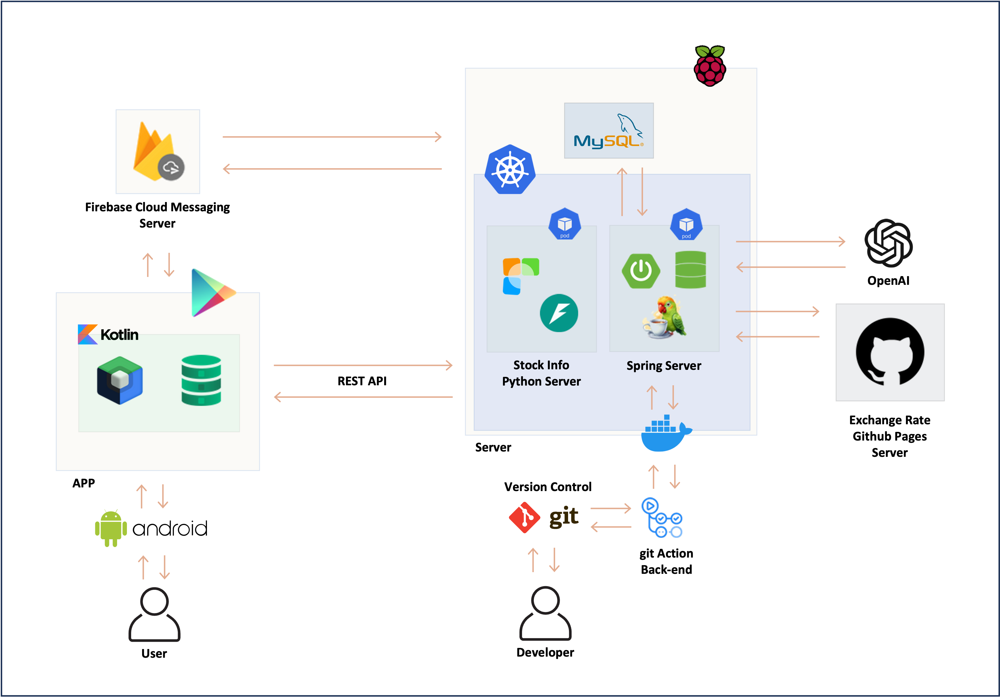

<h1 align="center">BigPicture</h1>

## 개요
AI 기반 거시경제 요약 리포트 서비스

## 시스템 아키텍처

## 담당한 기능
* [자동화 데이터 크롤링 구현](1-자동화-데이터-크롤링-구현)
* [리포트 생성 파이프라인 설계 및 구현](2-리포트-생성-파이프라인-설계-및-구현)
* [CI/CD 및 무중단 배포 인프라 구성](3-CI/CD-및-무중단-배포-인프라-구성)

## 1. 자동화 데이터 크롤링 구현
### 개요
### 문제 및 의사결정 과정
### 성과

## 2. 리포트 생성 파이프라인 설계 및 구현
### 개요
### 문제 및 의사결정 과정
### 성과

## 3. CI/CD 및 무중단 배포 인프라 구성
### 개요
### 문제 및 의사결정 과정
### 성과
